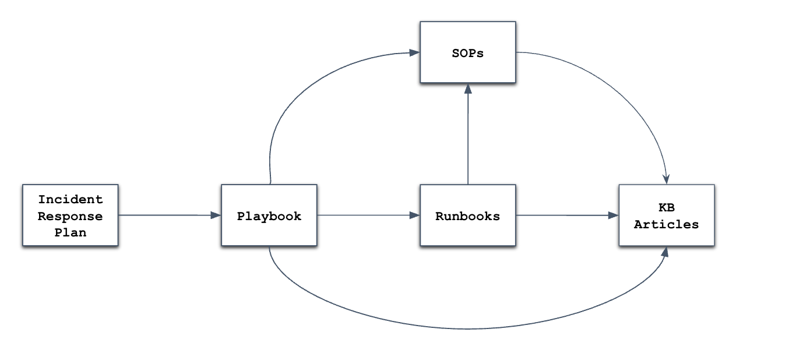

## What is Arcana
Arcana is a documentation methodology purpose-built for security incident response teams. It standardises the core building blocks of IR documentation - Incident Response Plans (IRPs), Playbooks, Runbooks, Standard Operation Procedures (SOPs) & Knowledge Base (KB) Articles - along with a consistent naming convention for each document type. Arcana also defines how these documents fit together: what each one is for, and how they link to each other. The result is IR documentation that's consistent, easy to maintain, and easy to navigate.

Because every team using Arcana follows the same structure, Playbooks, Runbooks, SOPs and KB articles can be shared across organisations as a starting point, saving teams from designing the response flow from scratch. The goal is a stronger IR community where teams build on each other's work instead of solving the same problems in isolation.

## Principles
Arcana is built on a small set of principles that apply to every document in the framework. They exist so that during an incident, responders can trust what they're reading and know who to ask if something looks wrong. These principles are borrowed from **docs-as-code**, where documentation is owned, reviewed, versioned, and released like source code.

- **Owned** - every document has an owner accountable for maintaining it and keeping it accurate.
- **Reviewed** - every document has one or more approvers who review it before publication, and is reviewed again on a defined cadence (with a next review date) to confirm it remains accurate.
- **Versioned** - every document has a version number and a change summary capturing what changed between versions and why, so readers can trace how the document has evolved over time.
- **Status-tracked** - every document carries an explicit status (e.g. Draft, Published, Retired) so responders know which ones are safe to use and which are out of date.

## Arcana at a glance
Arcana organises IR documentation into **five components**:



**Incident Response Plan**
- The top-level document defining the overall incident response strategy, lifecycle, and roles. 
- Playbooks inherit this structure, each one is organised around the same lifecycle and roles, but are applied to a specific incident type.

**Playbooks**:
- Scenario-specific response guides for a defined incident type (e.g. phishing, ransomware, supply chain) with branching response paths.
- Broken down into separate sections for each active response stage defined in the IRP (e.g. detection, analysis, containment, eradication, recovery and post-incident response).
- Each section references the Runbooks, SOPs, and KB articles needed to carry out that stage.

**Runbooks**:
- Technical, step-by-step guides for executing a single operational task during an incident (e.g. isolating a cloud host, resetting a compromised user's credentials)
- Ideally ten steps or less.
- May reference SOPs and KB articles when a step involves a cross-team process or deeper technical context.

**Standard Operating Procedures (SOPs)**:
- Documents that standardise a team or organisational process (e.g. paging on-call engineers during a security incident, customer notification for a confirmed data breach).
- Compliant, agreed by all teams involved, and auditable after the fact.
- May reference KB articles when a step requires deeper technical context or background knowledge.

**Knowledge Base Articles**:
- Act as technical reference guides for knowledge sharing (e.g. Linux Forensics Cheatsheet, How to use Volatility for Memory Forensics and Analysis, Manual AWS Snapshot Acquisition).
- Referenced by Runbooks, Playbooks, and SOPs when a step requires deeper technical context to execute.

## Comparing Document Types
| **Aspect** | **IRP** | **Playbook** | **Runbook** | **SOP** | **KB Article** |
| --- | --- | --- | --- | --- | --- |
| **Goal** | Define the overall response strategy, lifecycle, and roles | Investigate and resolve a specific incident type | Execute a specific operational task | Standardise a team or organisational process | Capture and share institutional knowledge |
| **Structure** | High-level framework: lifecycle stages, roles | Branching/decision-based steps | Linear steps | Formal, detailed, covers roles & compliance | Narrative/explanatory, topic-focused |
| **Scope** | Organisation-wide, strategic | Scenario-specific (e.g. phishing, ransomware) | Technical, single task | Cross-team, recurring processes | Any IR-relevant topic |
| **Flexibility** | Low (foundational, changes infrequently) | High (adaptive to investigation outcomes) | Low (prescriptive) | Low (covers all scenarios, less adaptive) | High (varied formats and depth) |
| **Audience** | Whole organisation, leadership, all incident responders | Incident responders | Any technical responder regardless of role | All teams involved in the process | All IR staff, broader security team |

## Document Naming Conventions
All documents in the Arcana framework should follow consistent naming conventions to make them easy to identify, reference, and search.
The format is `<PREFIX>-###: <Descriptor>`, where:
- `<PREFIX>` identifies the document type
- `###` is a zero-padded sequential number
- `<Descriptor>` is a short, human-readable title describing the document

| Document Type | Format | Descriptor | Example |
| --- | --- | --- | --- |
| Incident Response Plan | `Incident Response Plan` | N/A | `Incident Response Plan` |
| Playbook | `PB-###: <Descriptor>` | Incident scenario | `PB-001: Phishing` |
| Runbook | `RB-###: <Descriptor>` | Operational task | `RB-001: Isolating a Cloud Host` |
| Standard Operating Procedure (SOP) | `SOP-###: <Descriptor>` | Process being standardised | `SOP-001: Paging On-Call Engineers` |
| Knowledge Base Article | `KB-###: <Descriptor>` | Topic of the article | `KB-001: Volatility for memory forensics` |

## How To Implement Arcana
Arcana can be implemented in any tool that supports ownership, review, versioning, and status. The two common patterns:

### Git-based (docs-as-code): 
- Markdown files in a Git repository (e.g. GitHub, GitLab, Bitbucket), paired with a ticket system (e.g. Jira, Asana) for tracking ownership, next review date and document status. 
- The repository is configured to enforce approvals through required reviewers on pull requests (via GitHub Rulesets, Bitbucket branch restrictions, or GitLab merge request approval rules) and provides an immutable change history through commits.
- Higher startup cost, but the principles become difficult to violate. Best for engineering-heavy teams.

### Page-based (Confluence, Notion, Google Docs, etc.)
- Documents written as pages in a hosted documentation tool with built-in change history, with the principles enforced through a standard Document Control table embedded at the top of every page. 
- Lower setup cost, no engineering investment required, and works well for teams already using a hosted documentation platform.
- Unlike Git-based implementations, enforcing the principles requires someone to manually check that the Document Control table is accurate.

### How the principles are enforced:
Every Arcana document must enforce the four [principles](#principles). The mechanism differs by implementation:
| Principle | Git-based | Page-based |
| --- | --- | --- |
| **Owned** | Ownership tracked in a paired ticket system (e.g. Jira, Asana) | `Owner` field in the Document Control table |
| **Reviewed** | Required reviewers on pull requests, configured via GitHub Rulesets, Bitbucket branch restrictions, or GitLab merge request approval rules | `Approvers` field in the Document Control table |
| **Versioned** | Immutable change history through commits | `Version` and `Change Summary` fields in the Document Control table; platform's native page history |
| **Status-tracked** | Document status tracked in a paired ticket system | `Status` field in the Document Control table (e.g. Draft / Published / Retired) |

### The Document Control table (page-based)
For page-based implementations, the Document Control table is the source of truth. Every Arcana document begins with it, and it is the primary mechanism for enforcing the principles.
| Attribute | Value |
| --- | --- |
| Document Name | *e.g. Phishing Playbook* |
| Version | *e.g. v1.2* |
| Owner | *Person or team accountable for the document* |
| Approvers | *Person or people who reviewed and approved this version* |
| Status | *Draft / Published / Retired* |
| Next Review Date | *Date this document must be re-reviewed for accuracy* |
| Change Summary | *Brief description of what changed in this version* |

### Templates and examples
Templates for all five document types live in `/templates`. Refer to the `/playbooks`, `/runbooks`, `/sops` or `/kb` folders for examples. 

## Core Team
Arcana is maintained and developed by a core team focused on advancing incident response documentation, operational resilience, and documentation-as-code practices.
- Vishal Thakur
- Jayden Vo
- Amit Giri
- Kashish Srivastava
- Pooja Somu
- 
## Contributing to Arcana
## Contributing to Arcana

Arcana is a community-driven framework and contributions are encouraged from incident responders, SOC analysts, DFIR practitioners, threat hunters, detection engineers, and security teams across the industry.

Contributors can submit:

- Playbooks (PBs)
- Runbooks (RBs)
- SOPs
- Templates
- Knowledge Base (KB) articles
- Tutorials and How-To guides
- Detection and response workflows
- Documentation improvements and fixes

### How to Contribute

If you would like to contribute, simply:

1. Fork the repository to your own GitHub account
2. Create or update the relevant documentation/files
3. Commit your changes
4. Submit a Pull Request (PR) back to the main Arcana repository

A Pull Request (PR) is a GitHub feature that allows you to propose changes to a repository for review before they are merged into the main project. Once submitted, the Arcana core team will review the contribution, provide feedback if required, and merge approved changes into the framework.

### Documentation Templates

When creating new documentation for Arcana, contributors should use the templates available in the `templates/` section of the repository wherever possible. This helps maintain consistency, structure, naming conventions, and interoperability across the framework.

Templates can also be provided directly to AI tooling/assistants (such as ChatGPT, Claude, Gemini, Copilot, etc.) when generating new documentation to ensure outputs align with the Arcana format and standards.

### Contributor Attribution Format

Contributors are encouraged to add attribution at the bottom of any new documents using the following format:

```md
---

## Contributor

**Firstname Lastname**  
GitHub: https://github.com/account

Contributed to the Arcana Incident Response Documentation Framework.

```

Approved contributors will also be added to the Arcana Contributors page on both the GitHub repository and the official website.


## License

Distributed under the MIT License. See [`LICENSE`](LICENSE) for details.


